# vizop

**Opinionated data visualization for Python.** Publication-quality charts with minimal configuration.

[](https://pypi.org/project/vizop/)
[](https://pypi.org/project/vizop/)
[](LICENSE)

vizop produces clean, presentation-ready charts inspired by the visual style of the NYT and FiveThirtyEight — left-aligned titles, no chartjunk, smart defaults. Built on matplotlib, driven by DataFrames.

---

## Gallery

<table>
<tr>
<td align="center"><a href="#line-chart">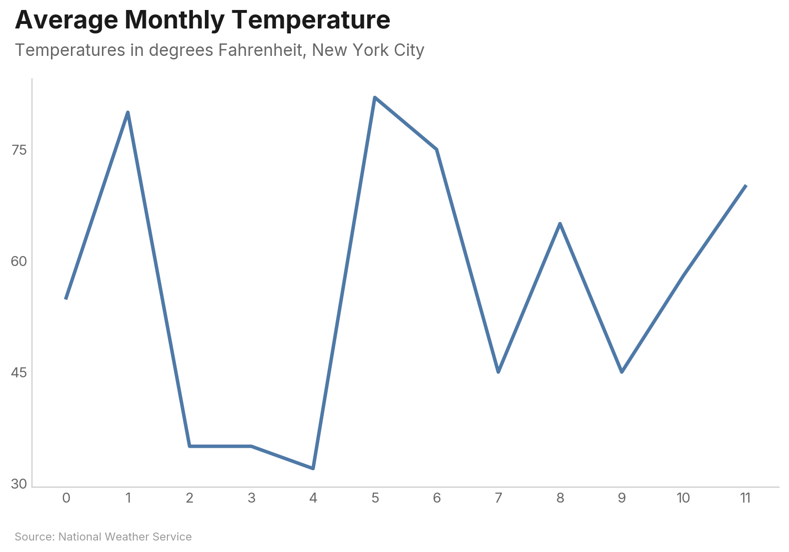<br/><b>Line</b></a></td>
<td align="center"><a href="#bar-chart">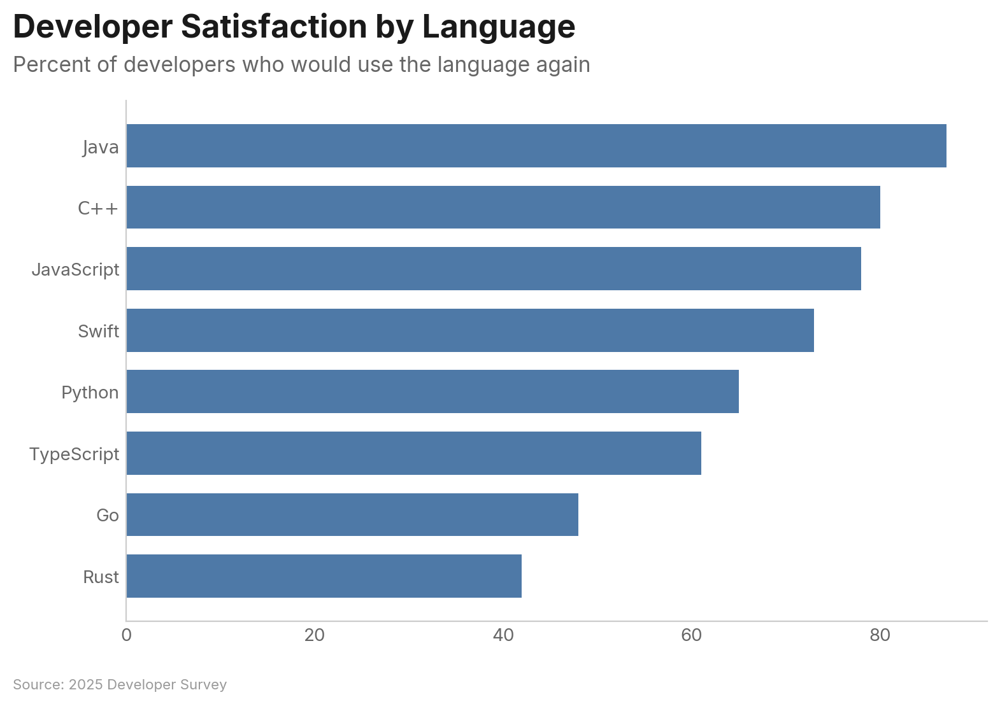<br/><b>Bar</b></a></td>
<td align="center"><a href="#scatter-plot">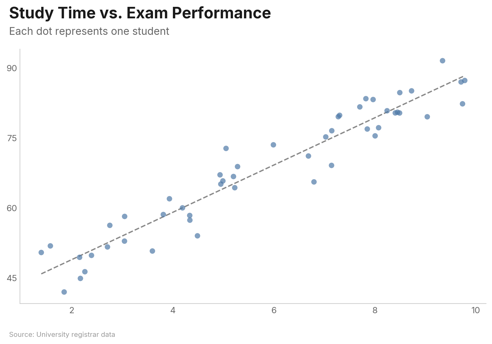<br/><b>Scatter</b></a></td>
<td align="center"><a href="#slope-chart">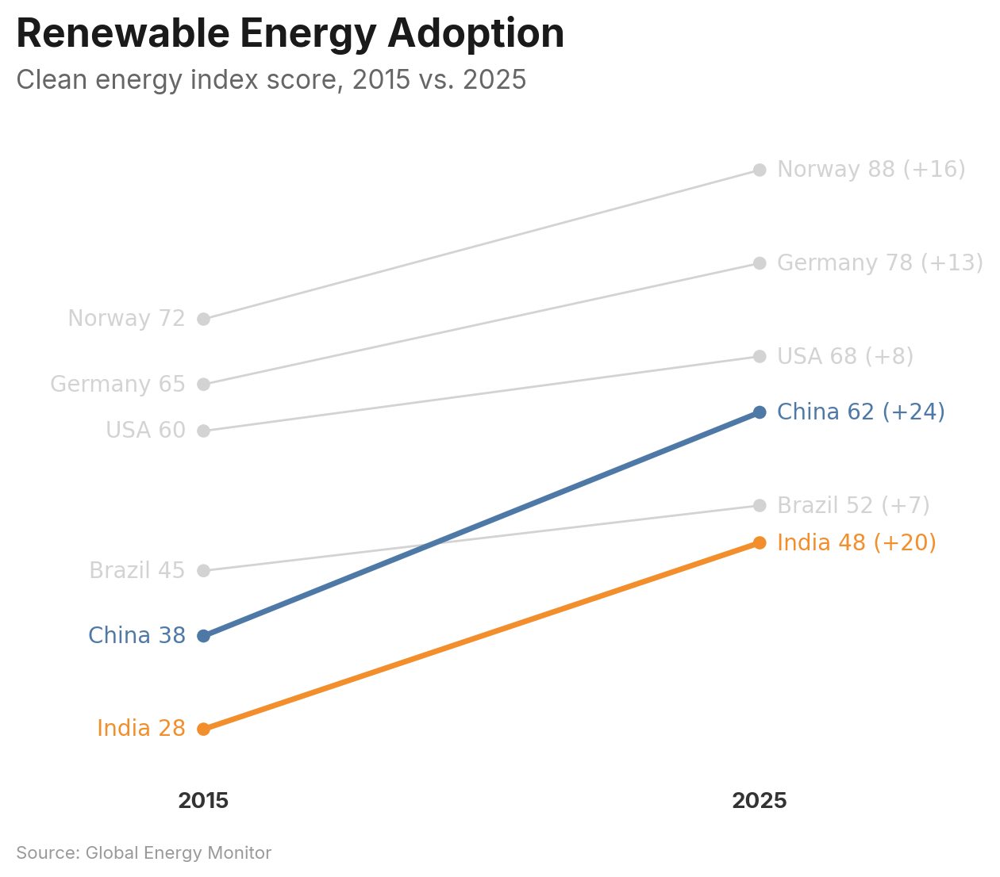<br/><b>Slope</b></a></td>
</tr>
<tr>
<td align="center"><a href="#waffle-chart">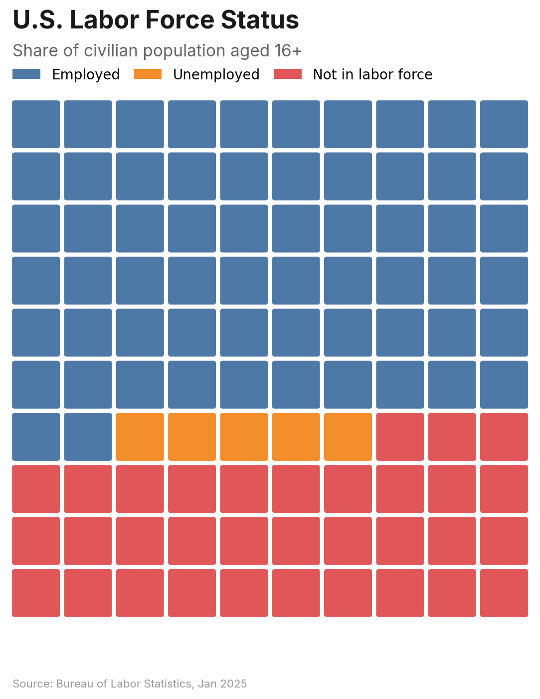<br/><b>Waffle</b></a></td>
<td align="center"><a href="#raincloud-plot">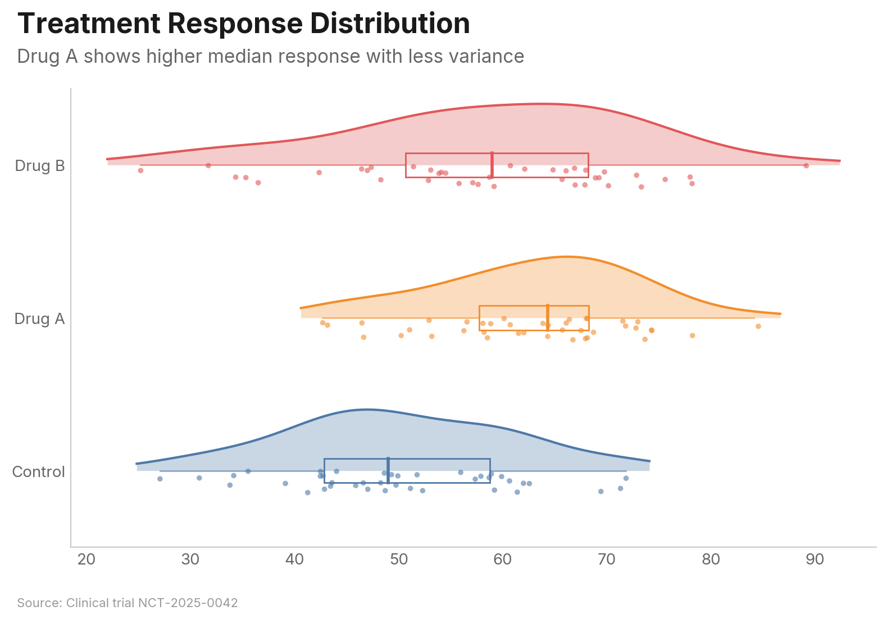<br/><b>Raincloud</b></a></td>
<td align="center"><a href="#parliament-chart">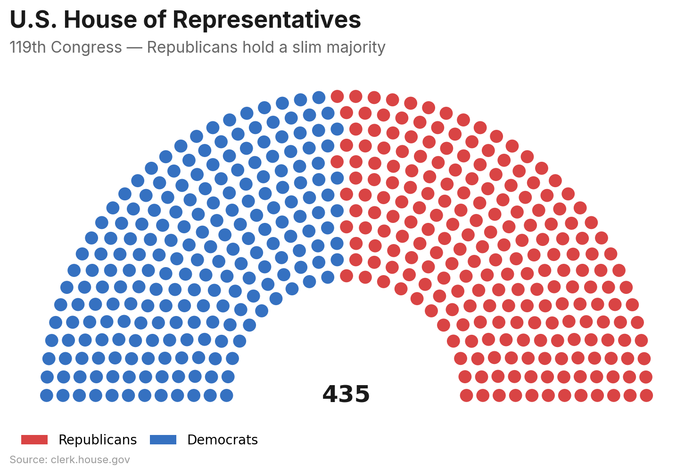<br/><b>Parliament</b></a></td>
<td align="center"><a href="#bump-chart">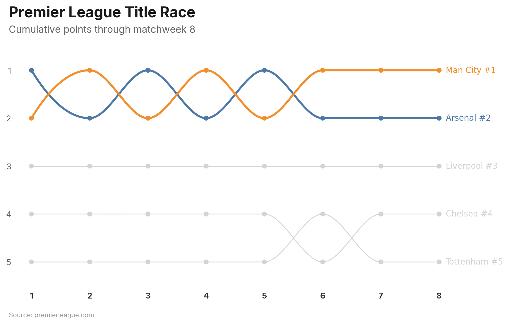<br/><b>Bump</b></a></td>
</tr>
</table>

---

## Installation

```bash
pip install vizop
```

or with [uv](https://docs.astral.sh/uv/):

```bash
uv add vizop
```

---

## Quick Start

```python
import pandas as pd
import vizop

df = pd.DataFrame({
    "month": ["Jan", "Feb", "Mar", "Apr", "May", "Jun",
              "Jul", "Aug", "Sep", "Oct", "Nov", "Dec"],
    "visitors": [1200, 1350, 1800, 2400, 2800, 3200,
                 3500, 3300, 2900, 2100, 1600, 1400],
})

chart = vizop.line(
    df, x="month", y="visitors",
    title="Monthly Website Visitors",
    subtitle="Pageviews peaked in July before seasonal decline",
    source="Internal analytics",
)
chart.show()
```

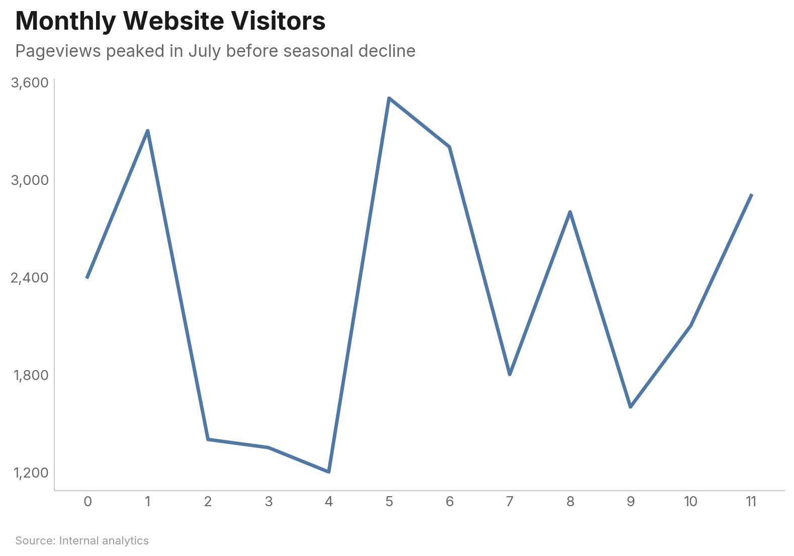

Every chart function returns a `Chart` object — call `.show()` to display, `.save("file.png")` to export, or just let it render inline in Jupyter.

---

## Charts

### Line Chart

Basic single-series line:

```python
df = pd.DataFrame({
    "month": ["Jan", "Feb", "Mar", "Apr", "May", "Jun",
              "Jul", "Aug", "Sep", "Oct", "Nov", "Dec"],
    "temperature": [32, 35, 45, 55, 65, 75, 82, 80, 70, 58, 45, 35],
})

vizop.line(
    df, x="month", y="temperature",
    title="Average Monthly Temperature",
    subtitle="Temperatures in degrees Fahrenheit, New York City",
    source="National Weather Service",
)
```


Multi-series with highlight — the highlighted series stays vivid while others are muted. Labels appear at line endpoints instead of a legend box:

```python
vizop.line(
    df, x="month", y="ridership", group="mode",
    highlight="Subway",
    title="NYC Transit Ridership by Mode",
    subtitle="Daily riders in thousands — subway dominates year-round",
    source="MTA Open Data",
)
```

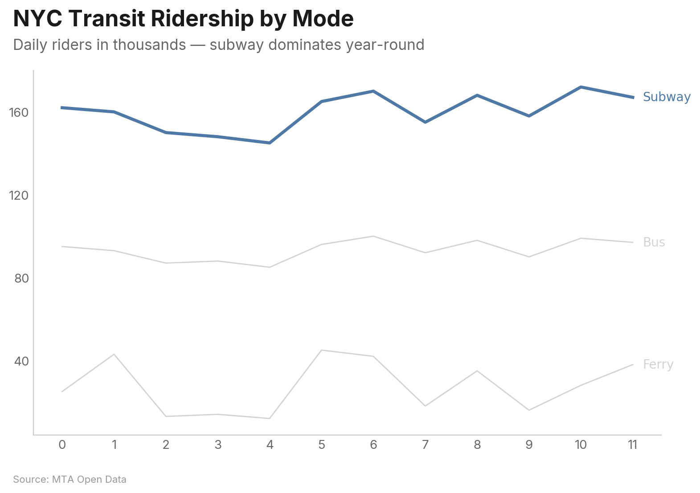

#### Key Parameters

| Parameter | Type | Description |
|---|---|---|
| `x` | `str` | Column for the x-axis |
| `y` | `str \| list[str]` | Column(s) for y-axis. List for wide-format multi-series |
| `group` | `str` | Column to group by (long format) |
| `highlight` | `str \| list[str]` | Series to highlight; others are muted |
| `show_area` | `bool` | Fill area under the line (single-series) |
| `zero_baseline` | `bool` | Force y-axis to start at 0 |
| `show_last_value` | `bool` | Display value at the last data point |
| `highlight_range` | `tuple` | `(start, end)` x-values to shade |

---

### Bar Chart

Bars are horizontal and sorted descending by default — the most important value is always at the top:

```python
df = pd.DataFrame({
    "language": ["Python", "JavaScript", "Java", "C++", "TypeScript",
                 "Go", "Rust", "Swift"],
    "satisfaction": [73, 61, 42, 48, 78, 80, 87, 65],
})

vizop.bar(
    df, x="language", y="satisfaction",
    title="Developer Satisfaction by Language",
    subtitle="Percent of developers who would use the language again",
    source="2025 Developer Survey",
)
```


Grouped bars for comparing across categories:

```python
vizop.bar(
    df, x="region", y="revenue", group="year",
    orientation="vertical", mode="grouped",
    title="Regional Revenue Growth",
    subtitle="Revenue in millions USD — all regions trending upward",
    source="Annual Report 2025",
)
```

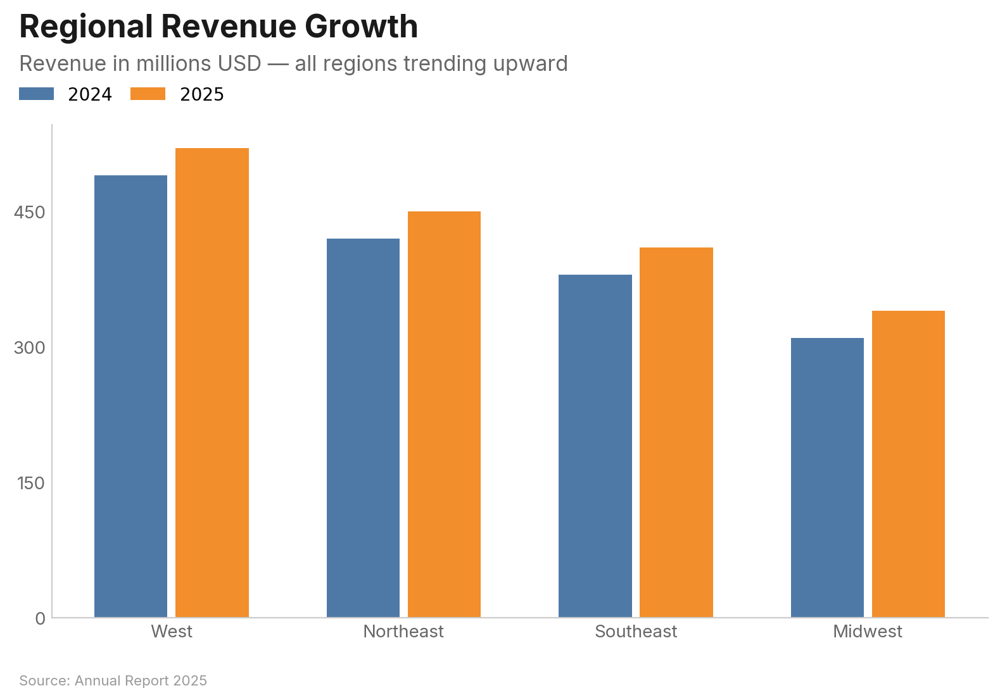

#### Key Parameters

| Parameter | Type | Description |
|---|---|---|
| `x` | `str` | Category column |
| `y` | `str \| list[str]` | Value column(s) |
| `group` | `str` | Group column (long format) |
| `orientation` | `str` | `"horizontal"` (default) or `"vertical"` |
| `mode` | `str` | `"grouped"` or `"stacked"` for multi-series |
| `sort` | `str \| None` | `"descending"` (default), `"ascending"`, or `None` |
| `limit` | `int` | Show only top N categories |
| `show_values` | `str` | Value labels: `"inside"`, `"inside_end"`, or `"outside"` |
| `reference_line` | `float` | Draw a dashed reference line at this value |

---

### Scatter Plot

```python
vizop.scatter(
    df, x="study_hours", y="exam_score",
    trend="linear",
    title="Study Time vs. Exam Performance",
    subtitle="Each dot represents one student",
    source="University registrar data",
)
```


Grouped scatter with highlight:

```python
vizop.scatter(
    df, x="experience", y="salary", group="department",
    highlight="Engineering",
    title="Salary vs. Experience by Department",
    subtitle="Engineering salaries grow fastest with tenure",
    source="HR analytics, 2025",
)
```

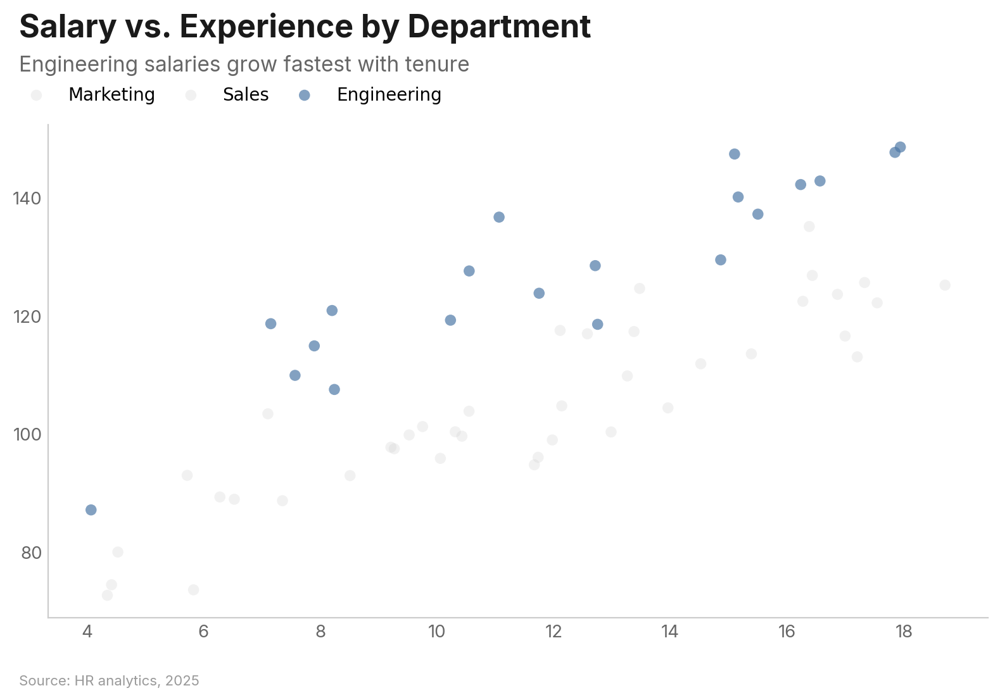

#### Key Parameters

| Parameter | Type | Description |
|---|---|---|
| `x` | `str` | Column for x-axis |
| `y` | `str` | Column for y-axis |
| `group` | `str` | Column for color-coded groups |
| `size` | `str` | Column for size encoding (bubble chart) |
| `label` | `str` | Column for point labels |
| `trend` | `str` | `"linear"`, `"lowess"`, or `None` |
| `opacity` | `float` | Point opacity (default 0.7) |
| `jitter` | `bool` | Add random noise to reduce overplotting |
| `log_x` / `log_y` | `bool` | Logarithmic axis scale |

---

### Slope Chart

Compare values between two time points. Supports both wide format (`label`/`left`/`right`) and long format (`x`/`y`/`group`):

```python
df = pd.DataFrame({
    "country": ["Norway", "Germany", "USA", "China", "Brazil", "India"],
    "2015": [72, 65, 60, 38, 45, 28],
    "2025": [88, 78, 68, 62, 52, 48],
})

vizop.slope(
    df, label="country", left="2015", right="2025",
    highlight=["China", "India"],
    show_change=True,
    title="Renewable Energy Adoption",
    subtitle="Clean energy index score, 2015 vs. 2025",
    source="Global Energy Monitor",
)
```


#### Key Parameters

| Parameter | Type | Description |
|---|---|---|
| `label` | `str` | Entity name column (wide format) |
| `left` / `right` | `str` | Value columns for each endpoint (wide format) |
| `x` / `y` / `group` | `str` | Long format alternative |
| `highlight` | `str \| list[str]` | Entities to highlight |
| `color_by_direction` | `bool \| dict` | Color by increase/decrease |
| `show_change` | `bool` | Show delta on right-side labels |
| `sort` | `str` | `"ascending"`, `"descending"`, or `None` |

---

### Waffle Chart

Proportional area chart using a grid of cells. Accepts a DataFrame or a simple dict:

```python
vizop.waffle(
    values={"Employed": 62, "Unemployed": 5, "Not in labor force": 33},
    title="U.S. Labor Force Status",
    subtitle="Share of civilian population aged 16+",
    source="Bureau of Labor Statistics, Jan 2025",
)
```


#### Key Parameters

| Parameter | Type | Description |
|---|---|---|
| `values` | `dict[str, float]` | Category-to-value mapping (dict mode) |
| `category` / `value` | `str` | Column names (DataFrame mode) |
| `style` | `str` | `"square"` (default), `"circle"`, or `"icon"` |
| `icon` | `str` | Built-in icon name (required when `style="icon"`) |
| `grid_size` | `int` | Cells per row/column (default 10 = 100 cells) |

---

### Raincloud Plot

Combines a half-violin density curve, box plot, and jittered strip plot for rich distribution visualization:

```python
vizop.raincloud(
    df, value="score", group="treatment",
    title="Treatment Response Distribution",
    subtitle="Drug A shows higher median response with less variance",
    source="Clinical trial NCT-2025-0042",
)
```


#### Key Parameters

| Parameter | Type | Description |
|---|---|---|
| `value` | `str \| list[str]` | Value column (long format) or columns (wide format) |
| `group` | `str` | Group column (long format) |
| `show_density` | `bool` | Show half-violin (default `True`) |
| `show_box` | `bool` | Show box plot (default `True`) |
| `show_points` | `bool` | Show strip points (default `True`) |
| `bandwidth` | `float` | KDE bandwidth (default: Scott's rule) |
| `jitter_width` | `float` | Vertical jitter range (default 0.15) |

---

### Parliament Chart

Semicircular seat layout for legislative composition. Accepts a DataFrame or dict:

```python
vizop.parliament(
    values={"Democrats": 213, "Republicans": 222},
    color_map={"Democrats": "#3571C1", "Republicans": "#D94444"},
    title="U.S. House of Representatives",
    subtitle="119th Congress — Republicans hold a slim majority",
    source="clerk.house.gov",
)
```


#### Key Parameters

| Parameter | Type | Description |
|---|---|---|
| `values` | `dict[str, int]` | Party-to-seats mapping (dict mode) |
| `party` / `seats` | `str` | Column names (DataFrame mode) |
| `rows` | `int` | Number of arc rows (auto-calculated if `None`) |
| `arc_degrees` | `float` | Arc span in degrees (default 180) |
| `majority_line` | `bool \| int` | Draw majority threshold (`True` = auto) |
| `center_label` | `str \| bool` | Label at arc center (`True` = total seats) |

---

### Bump Chart

Rank chart showing how entities change position over time. Values are automatically ranked within each period:

```python
vizop.bump(
    df, x="week", y="points", group="team",
    highlight=["Arsenal", "Man City"],
    title="Premier League Title Race",
    subtitle="Cumulative points through matchweek 8",
    source="premierleague.com",
)
```


#### Key Parameters

| Parameter | Type | Description |
|---|---|---|
| `x` | `str` | Time period column (3+ unique values) |
| `y` | `str` | Value column (auto-ranked per period) |
| `group` | `str` | Entity column |
| `highlight` | `str \| list[str]` | Entities to highlight |
| `top_n` | `int` | Show only top N by final rank |
| `show_rank` | `bool` | Append rank to endpoint labels (default `True`) |
| `rank_order` | `str` | `"desc"` (highest = rank 1) or `"asc"` |

---

## Configuration

Use `vizop.configure()` to set global defaults. Settings apply to all subsequent charts:

```python
vizop.configure(
    accent_color="#E15759",
    background="light_gray",
    source_label="Finance Dept.",
)
```

**Before** (defaults):

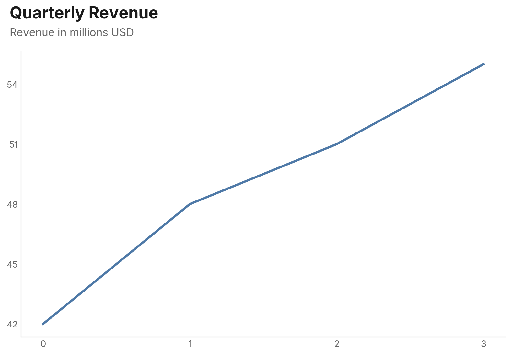

**After** configure:

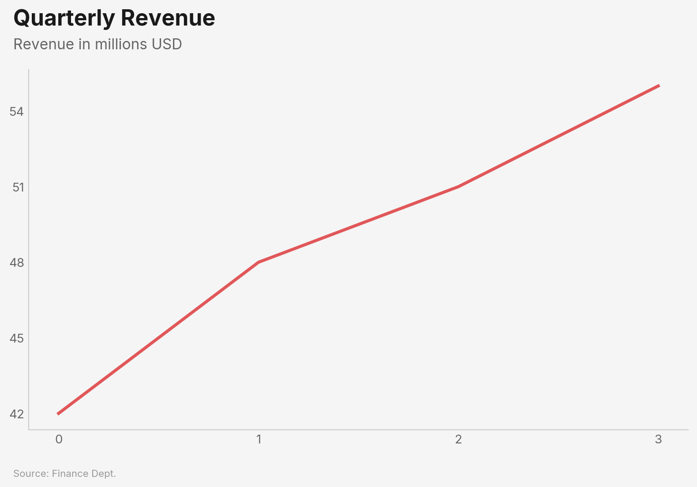

| Setting | Type | Default | Description |
|---|---|---|---|
| `accent_color` | `str` | `"#4E79A7"` | Default color for single-series charts |
| `font` | `str` | `"Inter"` | Font family (bundled: Inter, Libre Franklin, Source Sans Pro, IBM Plex Sans) |
| `background` | `str` | `"white"` | `"white"` or `"light_gray"` |
| `size` | `str` | `"standard"` | `"standard"`, `"wide"`, or `"tall"` |
| `source_label` | `str` | `None` | Default source text for all charts |
| `gridlines` | `bool` | `False` | Show gridlines by default |
| `dpi` | `int` | `300` | Output resolution for `.save()` |

---

## The Chart Object

Every chart function returns a `Chart` object:

```python
chart = vizop.line(df, x="date", y="value", title="My Chart")

chart.show()                    # Display interactively
chart.save("output.png")       # Save to file (default 300 DPI)
chart.save("output.png", dpi=150)  # Custom DPI
chart.to_base64()               # Base64-encoded PNG string
chart.close()                   # Close the matplotlib figure
```

In Jupyter notebooks, charts render inline automatically — no `.show()` needed.

---

## Philosophy

vizop is opinionated by design. These defaults exist so you spend time on your data, not your chart settings:

- **Titles are left-aligned** to the plot edge, matching the natural reading direction of Western text. Centered titles are a vestige of Excel defaults.
- **No legend boxes on line charts.** Labels appear directly at line endpoints where your eye already lands. Legends force readers to bounce between the legend and the data.
- **Bars sort descending by default.** The most important value goes at the top. Alphabetical bar order almost never helps the reader.
- **Horizontal gridlines only.** Vertical gridlines add noise without aiding value estimation. The sole exception is scatter plots, where both axes carry continuous data.
- **No top or right spines.** They frame the chart like a box but add zero information. Removing them lets the data breathe.

---

## License

MIT — see [LICENSE](LICENSE).
